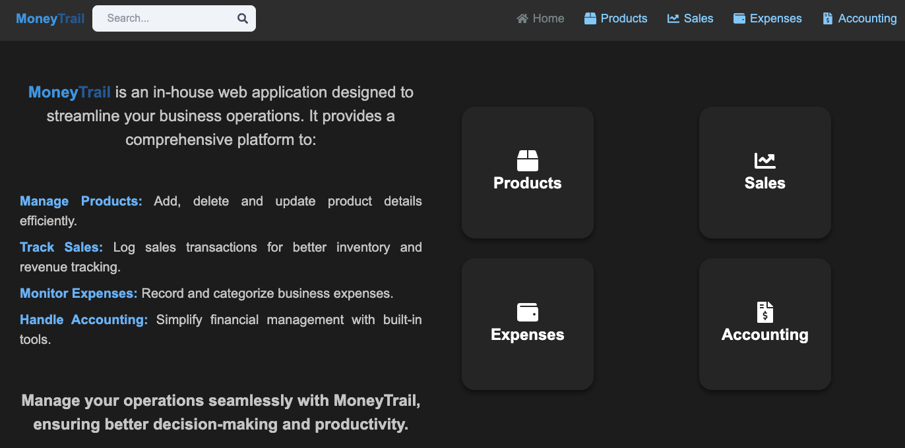
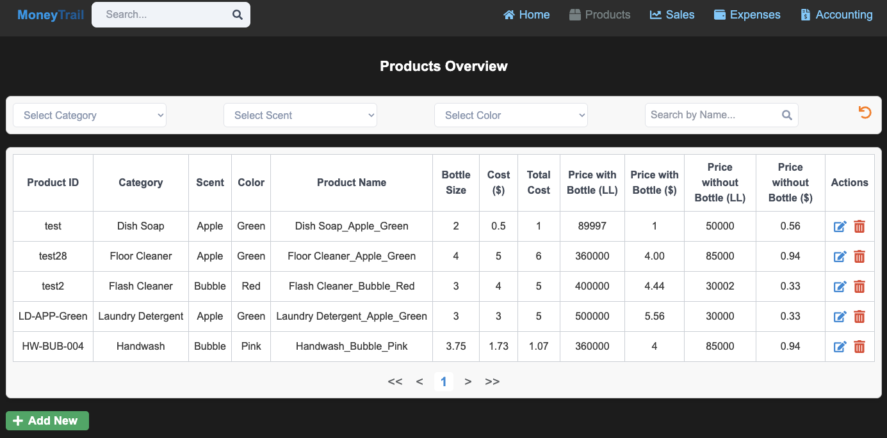
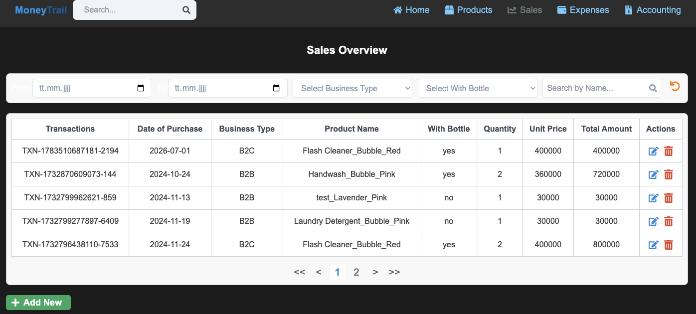
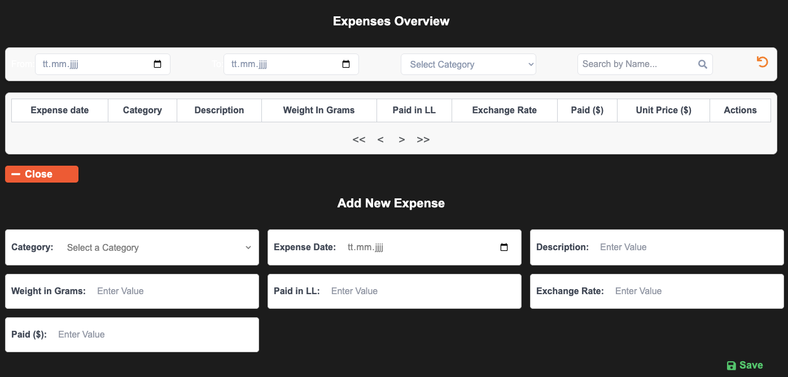
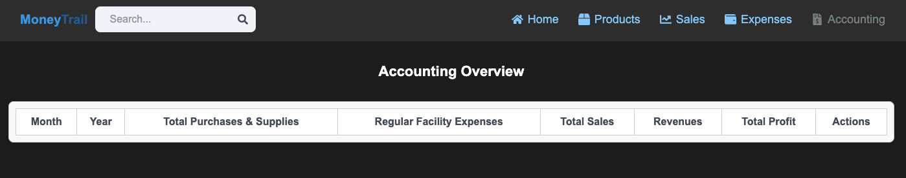

# MoneyTrail

MoneyTrail is a full-stack web application for managing small-business products, expenses, sales entries, and accounting summaries. It provides a simple dashboard-style interface for tracking business operations and reviewing financial activity in one place.

## Live Demo

[View the live app](https://moneytrail-raps.onrender.com/)

## Features

- Manage product records with category, scent, color, bottle size, cost, and selling price information
- Add, edit, delete, search, filter, and paginate product entries
- Record business expenses with category, date, description, exchange rate, paid amount, and unit price
- Track sales transactions with product name, business type, quantity, unit price, and total amount
- Generate accounting-style summaries from sales and expenses
- Responsive React frontend with reusable table, filter, dropdown, and pagination components
- Express and MongoDB backend with REST API routes for products, expenses, and sales

## Tech Stack

### Frontend

- React
- Vite
- React Router
- Tailwind CSS
- React Icons

### Backend

- Node.js
- Express.js
- MongoDB
- Mongoose
- dotenv

### Deployment

- Render

## Project Structure

```text
MoneyTrail/
├── api/
│   ├── controllers/
│   ├── models/
│   ├── routes/
│   ├── utils/
│   └── index.js
├── frontend/
│   ├── src/
│   │   ├── components/
│   │   ├── pages/
│   │   └── utils/
│   ├── package.json
│   └── vite.config.js
├── .env.example
├── .gitignore
├── package.json
└── README.md
```

## Main Pages

- **Home** — Overview page for the application
- **Products** — Product inventory management
- **Sales** — Sales transaction tracking
- **Expenses** — Business expense tracking
- **Accounting** — Financial summary view based on sales and expenses

## API Routes

### Health Check

```text
GET /api/health
```

Returns a simple status message confirming that the API is running.

### Products

```text
GET    /api/products
POST   /api/products
PUT    /api/products/:id
DELETE /api/products/:id
```

### Sales

```text
GET    /api/sales
POST   /api/sales
PUT    /api/sales/:id
DELETE /api/sales/:id
```

### Expenses

```text
GET    /api/expenses
POST   /api/expenses
PUT    /api/expenses/:id
DELETE /api/expenses/:id
```

### Accounting

```text
GET /api/accounting/summary
```

Returns a basic accounting summary, including total sales, total expenses, number of sales, and number of expenses.

## Getting Started

### Prerequisites

Make sure you have installed:

- Node.js
- npm
- MongoDB Atlas account or local MongoDB database

## Environment Variables

Create a `.env` file in the root directory:

```env
MONGO=your_mongodb_connection_string
PORT=3000
```

An example file is included as `.env.example`.

> Do not commit your real `.env` file to GitHub.

## Installation

Clone the repository:

```bash
git clone https://github.com/rhouhou/MoneyTrail.git
cd MoneyTrail
```

Install backend dependencies:

```bash
npm install
```

Install frontend dependencies:

```bash
cd frontend
npm install
cd ..
```

## Running the App Locally

Start the backend server from the root directory:

```bash
npm run dev:backend
```

The backend runs on:

```text
http://localhost:3000
```

In a second terminal, start the frontend development server:

```bash
npm run dev:frontend
```

The frontend runs with Vite, usually at:

```text
http://localhost:5173
```

During development, frontend API requests are proxied to the backend server at:

```text
http://localhost:3000
```

You can also still start the backend with:

```bash
npm run dev
```

## Production Build

Build the frontend and install dependencies:

```bash
npm run build
```

Start the production server:

```bash
npm start
```

The Express server serves the built frontend from:

```text
frontend/dist
```

## Screenshots

### Home



### Products



### Sales



### Expenses



### Accounting



## Current Status

MoneyTrail is a portfolio project demonstrating a MERN-style business management dashboard. The core product, sales, expense, and accounting summary features are implemented.

The backend includes REST API routes for products, sales, expenses, and accounting summaries. It also includes MongoDB ID validation, schema validation, clearer API error responses, a health check endpoint, API 404 handling, security headers, request size limits, and basic rate limiting.

The frontend includes product, sales, and expense management pages with filtering, pagination, add/edit/delete actions, loading states, success messages, and basic error handling for failed fetch, save, edit, and delete actions.

The project is deployed on Render and can also be run locally with a MongoDB connection string.

## Planned Improvements

- Add user authentication and protected routes
- Add role-based access for business/admin users
- Add automated backend tests for API routes
- Improve accounting summaries with date filters
- Add charts for sales, expenses, and profit trends
- Add export options for accounting reports
- Improve responsive design for smaller screens
- Clean and standardize field names across models and frontend forms
- Add demo screenshots and sample data

## Known Limitations

- Authentication and user roles are not currently implemented
- The app is intended as a portfolio/demo project
- Financial summaries are basic and should be reviewed before use in real business settings
- Environment variables must be configured before deployment

## License

This project is licensed under the MIT License. See the [LICENSE](LICENSE) file for details.
